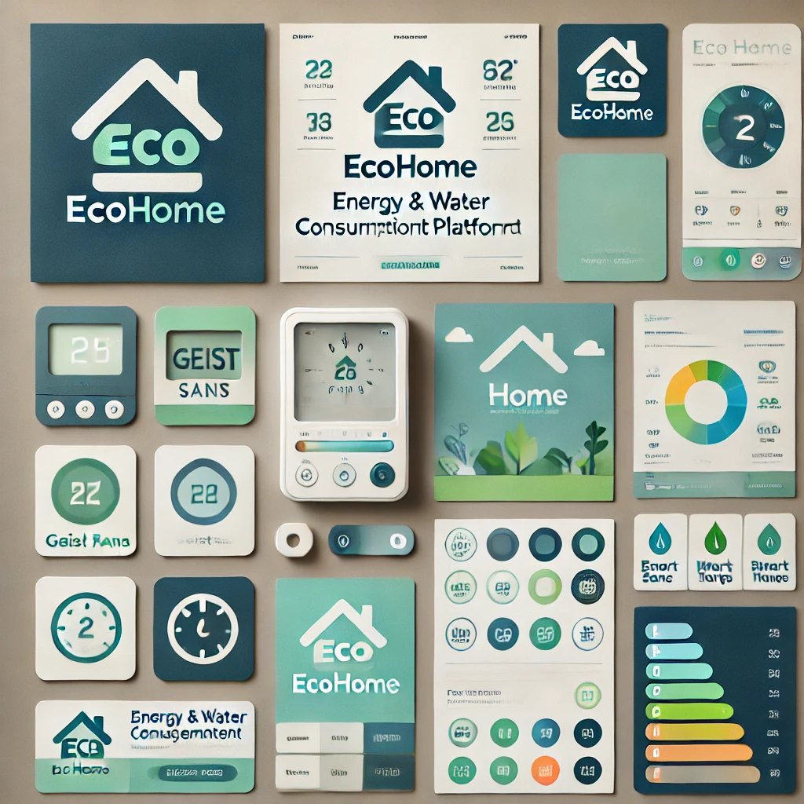

# **EcoHome Brand Design Manual**

## **1. Introduction**  
EcoHome is a modern and efficient web platform for managing energy and water consumption in rental properties. This brand design manual establishes the visual identity guidelines to ensure consistency and a professional look across all platforms.

---

## **2. Logo & Branding**  

### **Primary Logo**  
- The EcoHome logo consists of a clean and modern icon representing sustainability and technology.  
- The primary color scheme incorporates shades of **blue and green** to symbolize trust, efficiency, and eco-friendliness.  

### **Logo Usage**  
- The logo should always be used in its original form and should not be distorted, rotated, or recolored.  
- A **minimum clear space** must be maintained around the logo to ensure visibility.  

---

## **3. Color Palette**  

### **Primary Colors:**  
- **Eco Blue (#007BFF):** Represents technology and innovation.  
- **Sustainability Green (#28A745):** Symbolizes energy efficiency and eco-friendliness.  

### **Secondary Colors:**  
- **Light Gray (#F8F9FA):** Background and neutral elements.  
- **Dark Gray (#343A40):** Text and high-contrast elements.  

---

## **4. Typography**  

### **Primary Font:**  
- **Geist Sans** (For headlines and bold text)  
- **Inter** (For body text, readability-focused)  

### **Font Usage:**  
- **Headlines:** Geist Sans, Bold, 24px and up.  
- **Subheadings:** Inter, Semi-Bold, 18px.  
- **Body Text:** Inter, Regular, 16px.  

---

## **5. UI Components & Design Elements**  

### **Buttons:**  
- **Primary Button:** Blue background with white text.  
- **Secondary Button:** Green background with white text.  
- **Disabled Button:** Light gray background with dark gray text.  

### **Forms & Inputs:**  
- Rounded corners (**border-radius: 8px**)  
- Light gray background with dark gray text.  

### **Icons & Illustrations:**  
- Icons related to **energy, water consumption, smart meters, and eco-friendly visuals**.  

---

## **6. Imagery & Illustrations**  

### **Photography Style:**  
- Bright and modern imagery.  
- Focus on **energy efficiency, smart homes, and eco-conscious living**.  

### **Illustration Guidelines:**  
- **Flat vector-style illustrations** with soft gradients.  
- **Clean and minimalistic iconography**.  

---

## **7. Layout & Grid System**  
- The design follows a **12-column grid system** for responsiveness.  
- **Consistent spacing:** 16px margin and padding for UI elements.  
- **Section divisions** use subtle background color contrasts.  

---

## **8. Brand Voice & Messaging**  

### **Tone:**  
- Professional, friendly, and eco-conscious.  

### **Key Messages:**  
- *"Empowering sustainable energy management."*  
- *"Track, optimize, and save on utility consumption."*  
- *"A smart solution for a greener future."*  

---

## **9. Accessibility & Inclusivity**  
- **High Contrast Mode:** Ensuring readability for all users.  
- **Font Legibility:** Minimum font size of **16px**.  
- **Color-Blind Friendly Palette:** Avoiding color combinations that are difficult to distinguish.  

---

## **10. Applications & Use Cases**  

### **Web Application:**  
- Consistent UI following brand colors and typography.  

### **Marketing Materials:**  
- Flyers, social media posts, and presentations should follow the EcoHome branding guidelines.  

### **Printable Reports & Documents:**  
- **Standardized header and footer** with brand colors.  
- Use **Inter font** for all text content.  

---

## **11. MoodBoard

## **12. Final Notes & Brand Consistency**  
Maintaining consistency in branding ensures that **EcoHome remains recognizable and professional**.  
All team members and stakeholders should follow these guidelines to **preserve the brand identity** across all mediums.  

For further details or custom branding assets, contact the design team at **design@ecohome.com**.  

