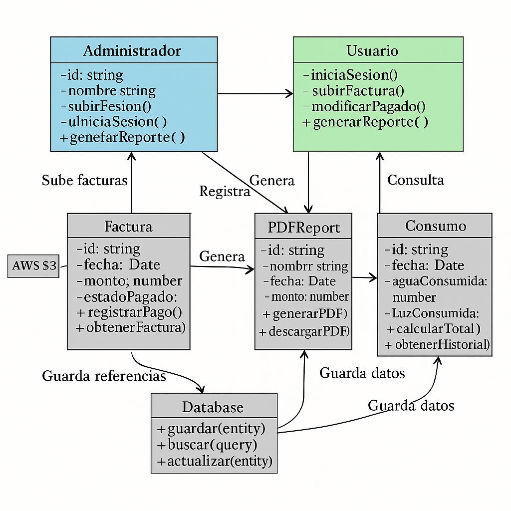

# **EcoHome – Energy and Water Consumption Management Platform**  

## **📖 Introduction**  
**EcoHome** is a modern and efficient web platform designed to manage and monitor water and electricity consumption in rental properties. Its main goal is to provide **property administrators** and **tenants** with a digital solution to register, visualize, and analyze utility consumption, improving transparency and financial control.  

By integrating advanced tools such as **cloud storage with Amazon S3** and **PDF report generation**, EcoHome enables users to make informed decisions about their resource usage, promoting more efficient and sustainable consumption.

---

## **🎯 Purpose of the Web App**  
The primary objective of EcoHome is to offer a **digital and automated platform** for **energy and water consumption management** in rental properties. Through its intuitive interface, administrators can **register, track, and analyze utility consumption**, while tenants can **access their consumption records and understand their expenses** over time.

---

## **👤 User Roles in the Application**  

### **1️⃣ Administrator**  
The administrator is responsible for managing tenant consumption and overseeing the platform.  

#### **Key Features:**  
- Secure login and authentication.  
- View the water and electricity consumption history of each tenant.  
- Upload images of meters to verify recorded consumption.  
- Generate monthly reports in **PDF format** summarizing utility usage.  
- Upload electricity and water bills to register payments and calculate costs.  
- Access a **multi-step form** preloaded with invoice data to automatically calculate the service costs (water, electricity, and total) for each tenant.  
- Mark whether a tenant has **paid or not** for the services directly from the UI.  
- Store images and documents in **Amazon S3** for secure access.  
- View payment status in the **billing history** and include this data in the **PDF reports**.  

### **2️⃣ User (Tenant)**  
Tenants can check their personal consumption history and view detailed cost calculations.

#### **Key Features:**  
- Log in and access their **monthly consumption history**.  
- Access a **multi-step form** to view a detailed breakdown of their consumption and costs.  
- Download **PDF reports** with the final calculation of their payments, including payment status.  
- Retrieve past consumption data stored securely.

---

## UML web app




## **🛠️ Technologies Used**  
To ensure optimal performance and a smooth user experience, EcoHome utilizes the following technologies:  

### **📌 Frameworks and Libraries**  
✅ **Next.js** → Core framework for the web app.  
✅ **ShadCN** → For optimized and stylized UI components.  
✅ **Zustand** → For **state management** across the application.  
✅ **TanStack Query** → For **efficient asynchronous data handling**.  
✅ **TypeScript** → Ensures **strong typing** and better code maintainability.  

### **📌 Integrations**  
✅ **Amazon S3** → Secure cloud storage for **images and PDF files**.  
✅ **NextAuth.js** → Secure authentication and session management.  
✅ **jsPDF** → To generate **monthly reports in PDF format**.  

### **📌 Database**  
✅ **PostgreSQL ** → For storing **user, consumption, and invoice data**.  

---

## **🔐 Security**  
To guarantee privacy and data security, EcoHome implements:  
- **Authentication with NextAuth.js**, allowing access only to **authorized users**.  
- **Role-based access control (RBAC)** to restrict functionalities according to user type (**Administrator or Tenant**).  
- **Secure cloud storage** with Amazon S3 to protect documents and sensitive data.  
- **Data encryption** and **HTTPS usage** to prevent information leaks.  

---

## **📊 Benefits of EcoHome**  
✅ **Automation & Accuracy:** Automatically calculates **each tenant’s monthly consumption**.  
✅ **Transparency & Control:** Keeps **detailed records of consumption history, costs, and payment status**.  
✅ **Secure & Centralized Access:** Stores **essential documents in the cloud**.  
✅ **User-Friendly Interface:** Optimized UI, responsive for all devices.  
✅ **Sustainability:** Encourages **efficient resource usage** through reports and consumption analysis.  

---

# 🧭 Flujo de Navegación del Usuario en la Web App – EcoHome

Cuando un usuario llega a **EcoHome**, su navegación debe ser **clara, intuitiva y eficiente**. A continuación, te explico cómo es la experiencia de usuario desde que accede a la web hasta que realiza sus acciones principales.

---

## **1️⃣ Acceso Inicial – Página de Inicio (Landing Page)**

📌 **Ruta:** `/` (Página principal antes de iniciar sesión)

🔹 **Elementos clave:**  
✅ Breve descripción de la plataforma y su funcionalidad.  
✅ Botones de **"Iniciar Sesión"** y **"Registrarse"**.  
✅ Imagen o ilustración representativa del servicio.  
✅ Información sobre la gestión del consumo de agua y luz.  

🖥 **Ejemplo de contenido:**  
```
Bienvenido a EcoHome - Administra tu consumo de energía y agua de manera eficiente.
🔹 Visualiza tu historial de consumo
🔹 Descarga reportes detallados
🔹 Optimiza tus gastos en servicios
```  

👆 **Acción principal:** El usuario hace clic en **"Iniciar Sesión"** o **"Registrarse"**.

---

## **2️⃣ Inicio de Sesión / Registro**

📌 **Ruta:** `/auth/login` (Iniciar sesión) / `/auth/register` (Registro)

🔹 **Acciones disponibles:**  
✅ **Usuario existente:** Introduce su correo y contraseña.  
✅ **Nuevo usuario:** Rellena el formulario de registro con datos básicos.  
✅ **Opción de autenticación con Google o redes sociales (si está configurado).**  

📌 **Después del login:**  
- 🔹 Si es **Administrador**, redirige a `/admin/dashboard`.  
- 🔹 Si es **Inquilino**, redirige a `/dashboard`.  

🔐 **Protección:** Si el usuario intenta acceder a una página sin iniciar sesión, será redirigido a `/auth/login`.

---

## **3️⃣ Dashboard – Vista Principal**

📌 **Ruta:** `/dashboard` (Para inquilinos) / `/admin/dashboard` (Para administradores)

🔹 **Elementos clave:**  
✅ **Resumen del consumo mensual** de agua y electricidad.  
✅ **Gráfico de tendencia de consumo** en los últimos meses.  
✅ **Acceso rápido a facturación y reportes**.  
✅ **Notificaciones de consumo alto o alertas importantes**.  

🖥 **Ejemplo de tarjetas en el dashboard:**  
```
🔹 Agua consumida: 15.8 m³  
🔹 Electricidad consumida: 120.3 kWh  
🔹 Costo total: $85.75  
🔹 Estado de pago: Pagado / Pendiente
```  

👆 **Acciones disponibles:**  
- Ver historial de consumo.  
- Descargar reporte de consumo mensual.  
- Acceder a detalles de facturación.

---

## **4️⃣ Historial de Consumo**

📌 **Ruta:** `/consumption-history`

🔹 **Acciones disponibles:**  
✅ Consultar consumo mensual en una tabla o gráfico.  
✅ Comparar el consumo de diferentes meses.  
✅ Filtrar por rango de fechas.  
✅ Ver estado de pago de cada factura.  
✅ Descargar reporte en PDF.  

👆 **Ejemplo de interacción:**  
- El usuario selecciona un mes para ver cuánto ha consumido en comparación con meses anteriores y si ya ha pagado.

---

## **5️⃣ Facturación y Costos**

📌 **Ruta:** `/billing`

🔹 **Acciones disponibles:**  
✅ Ver facturas de agua y luz de meses anteriores.  
✅ Consultar costos calculados automáticamente.  
✅ Ver y modificar el estado de pago desde la UI (solo admin).  
✅ Descargar PDF con resumen de pagos.  

👆 **Ejemplo de interacción:**  
- El administrador cambia el estado de una factura a "Pagado", y el inquilino puede ver la actualización.

---

## **6️⃣ Generación de Reportes**

📌 **Ruta:** `/reports`

🔹 **Acciones disponibles:**  
✅ Generar reportes en PDF con datos detallados del consumo.  
✅ Filtrar reportes por fechas y tipos de servicio.  
✅ Incluir estado de pago en los reportes.  

👆 **Ejemplo de interacción:**  
- El usuario selecciona el período **"Últimos 6 meses"** y descarga un reporte en PDF con gráficos, costos desglosados y estados de pago.

---

## **7️⃣ Configuración del Usuario**

📌 **Ruta:** `/settings`

🔹 **Acciones disponibles:**  
✅ Modificar datos personales (nombre, email).  
✅ Cambiar contraseña.  
✅ Configurar alertas de consumo alto.  

👆 **Ejemplo de interacción:**  
- El usuario activa una alerta para recibir un aviso si su consumo de electricidad supera los 500 kWh en un mes.

---

## **8️⃣ Cierre de Sesión**

📌 **Ruta:** `/logout`

👆 **Acción:**  
- El usuario cierra sesión y es redirigido a la **página de inicio (`/`)**.

---

## **📍 Resumen del Flujo de Navegación**

1️⃣ **Usuario visita** `/` (Landing Page).  
2️⃣ **Inicia sesión** en `/auth/login`.  
3️⃣ **Es redirigido al dashboard** `/dashboard` o `/admin/dashboard`.  
4️⃣ **Explora las funciones principales:**  
   - 🔹 Historial de Consumo → `/consumption-history`  
   - 🔹 Facturación → `/billing`  
   - 🔹 Reportes → `/reports`  
   - 🔹 Configuración → `/settings`  
5️⃣ **Puede descargar reportes o consultar costos.**  
6️⃣ **Cierra sesión y regresa a la landing page.**  

## **Estrucutra del proyecto **

/
├── public/
│   ├── og-image.png
│   └── logo.svg

├── src/
│   ├── app/                          # Rutas y páginas (App Router)
│   │   ├── layout.tsx
│   │   ├── page.tsx                  # Landing pública
│   │   ├── auth/
│   │   │   ├── login/page.tsx
│   │   │   └── register/page.tsx
│   │   ├── dashboard/page.tsx        # Inquilino
│   │   ├── admin/dashboard/page.tsx  # Admin
│   │   ├── billing/page.tsx
│   │   ├── reports/page.tsx
│   │   ├── consumption-history/page.tsx
│   │   ├── settings/page.tsx
│   │   └── api/
│   │       ├── auth/[...nextauth]/route.ts
│   │       ├── billing/route.ts
│   │       ├── reports/route.ts
│   │       └── users/route.ts

│   ├── components/                   # Componentes reutilizables
│   │   ├── layout/                   # Navegación
│   │   │   ├── Header.tsx
│   │   │   ├── Sidebar.tsx
│   │   │   └── DashboardShell.tsx
│   │   ├── billing/                  # Subcomponentes de facturación
│   │   │   ├── BillingTable.tsx
│   │   │   └── BillingStatusToggle.tsx
│   │   ├── charts/                   # Visualización de consumo
│   │   │   └── ConsumptionChart.tsx
│   │   ├── forms/
│   │   │   ├── ConsumptionForm.tsx
│   │   │   └── InvoiceUploadForm.tsx
│   │   └── ui/                       # Base Shadcn

│   ├── lib/                          # Lógica pura y utilidades
│   │   ├── auth.ts                   # Roles y sesión
│   │   ├── s3.ts                     # Amazon S3 client
│   │   ├── pdf.ts                    # Generación de PDF
│   │   └── utils.ts

│   ├── services/                     # Capa de negocio (usa fetch o react-query)
│   │   ├── billingService.ts
│   │   ├── reportService.ts
│   │   └── userService.ts

│   ├── store/                        # Zustand stores
│   │   ├── useUserStore.ts
│   │   └── useBillStore.ts

│   ├── types/                        # Tipos TypeScript compartidos
│   │   ├── user.ts
│   │   ├── bill.ts
│   │   └── consumption.ts

│   ├── styles/
│   │   └── globals.css

│   └── config/                       # Configuraciones externas (opcional)
│       ├── auth.config.ts
│       └── site.ts                   # Nombre del proyecto, metadata global

├── .env.local
├── next.config.mjs
├── tailwind.config.ts
├── tsconfig.json
├── README.md
├── middleware.ts
└── package.json

## **🚀 Conclusion**  
EcoHome **revolutionizes the way tenants and administrators manage utility consumption** in rental properties. Through its **intuitive and optimized digital platform**, it enables **detailed tracking of consumption**, facilitates **cost administration**, and promotes **efficient energy management**, including **clear tracking of payment status**.
