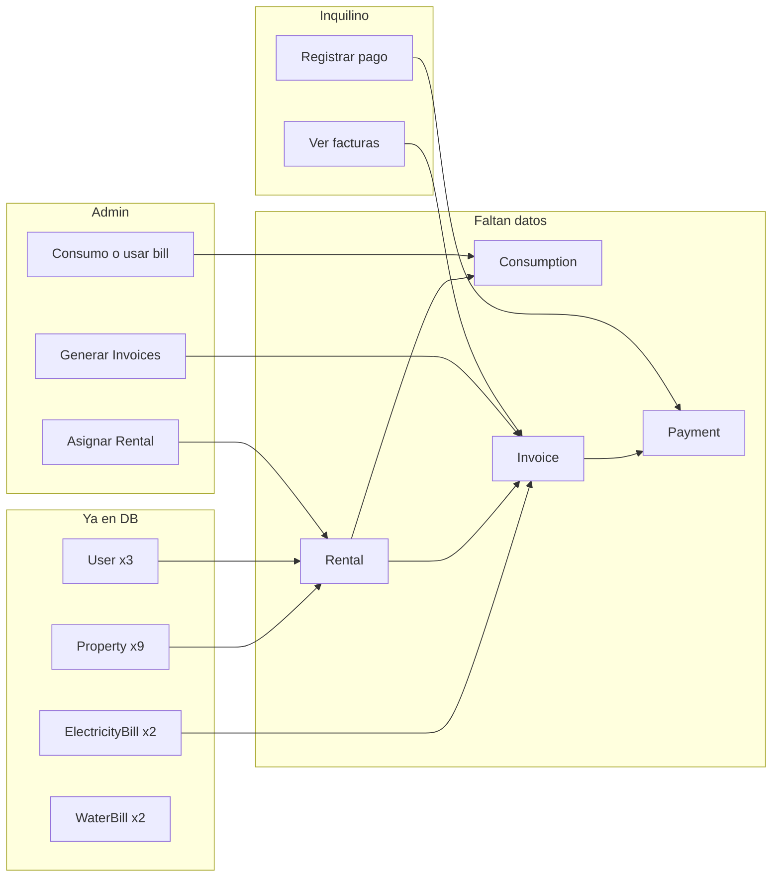

# Plan MVP, seed, documentación y tests unitarios (actualizado con estado DB)

## Estado actual de la base de datos

Conteo real (script `pnpm exec tsx scripts/db-count.ts`):

| Tabla | Cantidad | Nota |
|-------|----------|------|
| User | 3 | Hay usuarios (incl. E2E y posiblemente admin) |
| Account | 3 | Cuentas OAuth |
| Property | 9 | Ya hay propiedades |
| ElectricityBill | 2 | Facturas de luz con ServiceCharges |
| WaterBill | 2 | Facturas de agua con WaterServiceCharges |
| Rental | 0 | **Sin contratos** |
| Consumption | 0 | **Sin lecturas** |
| Invoice | 0 | **Sin facturas por inquilino** |
| Payment | 0 | **Sin pagos** |

Conclusión: hay **usuarios y propiedades y facturas de luz/agua a nivel propiedad**, pero **no hay flujo inquilino**: faltan Rental → Consumption → Invoice → Payment. El plan prioriza cerrar ese hueco sin borrar ni duplicar lo que ya existe.

---

## 1. Flujo MVP a validar

- **Admin:** usar propiedades/usuarios existentes → crear **Rentals** (asignar inquilino a propiedad), cargar **Consumption** o apoyarse en bills existentes, **generar Invoices** para un periodo.
- **Inquilino:** login → dashboard → **listado de Invoices** → **registrar Payment**.

No se cambia el schema. Se trabaja sobre las 9 propiedades y usuarios existentes donde tenga sentido.

---

## 2. Seed de desarrollo (respetando lo que ya hay)

**Objetivo:** Añadir solo los datos que faltan para poder probar el flujo inquilino (Rental, Consumption, Invoice, Payment) **sin borrar** los 9 Property ni los 2 ElectricityBill/WaterBill existentes.

**Archivo:** [prisma/seed.ts](prisma/seed.ts)

**Lógica:**

1. **Siempre (CI y local):** upsert del usuario E2E (como ahora) si existe `E2E_TEST_USER_EMAIL` o por defecto `e2e@test.com`.
2. **Solo en desarrollo (cuando no es CI):**  
   - Si no hay ningún **Rental**, crear 1–2 rentals: vincular usuarios existentes (por ejemplo el usuario E2E o el primer USER) con propiedades existentes (por ejemplo la primera Property que tenga admin o la primera disponible). Fechas vigentes (startDate/endDate).  
   - Si no hay **Consumption** para esos rentals, crear 1–2 consumos (rentalId, month, year, lecturas).  
   - Si no hay **Invoice**, generar al menos 1 invoice para uno de esos rentals (rentalId, month, year, waterCost, energyCost, totalCost, UNPAID) para poder probar listado y pago desde UI.  
   - No crear más Property ni más User si ya hay 9 y 3; opcionalmente crear 1 usuario admin de desarrollo si no existe ninguno con role ADMIN (para probar generación de invoices desde admin).

Contraseñas conocidas (ej. `Dev1234!`) documentadas en el doc de estado. Seed idempotente: comprobar existencia antes de crear (p.ej. “si Rental.count === 0 entonces crear”, o “upsert por criterio único”).

---

## 3. Documentación de estado del producto

**Archivo:** `docs/STATE.md`

**Contenido:**

- **Listo:** login, dashboards (tenant/admin), listado de facturas (tenant), listado de facturas luz/agua (admin), CI (lint, unit, build, E2E), script `scripts/db-count.ts` para revisar estado DB.
- **Datos actuales:** resumir que hay User, Property, ElectricityBill, WaterBill; faltan Rental, Consumption, Invoice, Payment (o actualizar tras el seed).
- **Parcial:** flujo admin (crear rental → consumo/factura → generar invoices), flujo pago desde UI.
- **Próximos pasos:** E2E de un recorrido MVP completo (opcional), reportes/notificaciones.
- **Cómo correr en local:** `pnpm dev`, `pnpm prisma db seed`, usuarios de desarrollo y qué datos crea el seed.

---

## 4. Tests unitarios (capa de aplicación)

Mismo criterio que antes; los casos de uso no dependen del estado de la DB (usan mocks).

| Caso de uso | Archivo de test | Casos |
|-------------|-----------------|--------|
| GetInvoiceById | `tests/unit/application/Invoice/GetInvoiceById.test.ts` | null si no existe; retorna invoice si existe; ADMIN accede a cualquiera; USER solo al suyo; USER otro userId → InvoiceAccessDeniedError. |
| GetRentalById | `tests/unit/application/Rental/GetRentalById.test.ts` | null si no existe; retorna rental; ADMIN cualquiera; USER solo el suyo; USER otro → RentalAccessDeniedError. |
| CreateRentalPayment | `tests/unit/application/Payment/CreateRentalPayment.test.ts` | Rental no existe → RentalNotFoundError; rental existe → crea pago y llama a paymentRepository.create. |
| CreateServicePayment | `tests/unit/application/Payment/CreateServicePayment.test.ts` | Invoice no existe → InvoiceNotFoundForPaymentError; invoice existe → crea pago; opcional: total pagado ≥ totalCost → updateStatusInTransaction(PAID). |

Patrón: mismo que [tests/unit/application/Invoice/GetUserInvoices.test.ts](tests/unit/application/Invoice/GetUserInvoices.test.ts) (mocks con `vi.fn()`, entidades de dominio, ejecutar `execute` y afirmar llamadas y resultados).

---

## 5. E2E del MVP

- Mantener los E2E actuales en verde (auth, dashboard, billing, consumption, payments).
- Opcional: un E2E “happy path” que recorra login admin → (usar propiedad/usuarios existentes o fixture) → crear rental → generar invoice → login tenant → ver factura → registrar pago. Puede depender de que el seed de desarrollo deje datos estables (por ejemplo un rental + invoice UNPAID).

---

## Orden de implementación recomendado

1. **Tests unitarios** (4 archivos): GetInvoiceById, GetRentalById, CreateRentalPayment, CreateServicePayment.
2. **Seed de desarrollo:** extender [prisma/seed.ts](prisma/seed.ts) para crear solo Rental, Consumption, Invoice (y opcionalmente Payment) cuando no sea CI, usando User y Property ya existentes.
3. **Documentación:** crear `docs/STATE.md` con estado del producto y uso del seed/db-count.
4. **Comprobar:** `pnpm run test:unit`, CI, y tras el seed volver a ejecutar `pnpm exec tsx scripts/db-count.ts` para verificar Rental/Invoice/Payment > 0.
